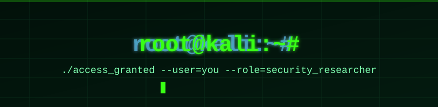

<div align="center">


<br></br>
  


<br></br>



<br></br>


<br></br>


<br></br>

<background style="background-image:url('https://i.pinimg.com/originals/e2/8d/61/e28d61b0ce1b686bbd9c19b98912101f.gif');position:absolute;top:0;left:0;width:100%;height:1100%;z-index:-1;"></background>

</div>

<br/>

<div align="center">
 <background style="background-image:url('https://i.pinimg.com/originals/e2/8d/61/e28d61b0ce1b686bbd9c19b98912101f.gif');position:absolute;top:0;left:0;width:100%;height:1100%;z-index:-1;"></background>
  
  
</div>


<br></br>


## `whoami`

```

> Name        : JAY BODA
> Role        : Cybersecurity Learner / Aspiring Pentester
> Focus       : Kali Linux, Networking, Web App Security, CTFs
> Currently   : Learning offensive security fundamentals
> Fun fact    : My terminal is my happy place 🐧

```


## 🛠️ Tools & Arsenal

<div align="center">


</div>

<div align="center">
  <background style="background-image:url('https://i.pinimg.com/originals/e2/8d/61/e28d61b0ce1b686bbd9c19b98912101f.gif');position:absolute;top:0;left:0;width:100%;height:1100%;z-index:-1;"></background>
  
</div>


## 📟 Everyday Kali Linux Reference

A quick cheat-sheet of commands I use often (system admin & recon basics — no exploit payloads, just the everyday toolkit):

```bash
# --- System ---
sudo apt update && sudo apt full-upgrade -y      # keep Kali up to date
neofetch                                          # flex your system info
history | tail -20                                # see recent commands

# --- Networking / Recon ---
ip a                                              # show network interfaces
nmap -sV -T4 192.168.1.0/24                       # service/version scan on local subnet
whois example.com                                 # domain registration lookup
dig example.com ANY                               # DNS record lookup
traceroute example.com                            # trace network path

# --- Packet Analysis ---
sudo tcpdump -i eth0 -n                           # live packet capture
wireshark                                         # GUI packet analysis

# --- Web ---
curl -I https://example.com                       # check response headers
gobuster dir -u https://example.com -w wordlist.txt  # directory brute force (own lab targets only)

# --- Password / Hash practice (on your own test files only) ---
hashid hash.txt                                   # identify hash type
john --wordlist=rockyou.txt hash.txt              # practice cracking in a lab

# --- Wireless (own hardware/lab only) ---
sudo airmon-ng start wlan0                        # enable monitor mode
sudo airodump-ng wlan0mon                         # capture nearby traffic info
```

> ⚠️ These are reference commands for **learning on your own systems / authorized labs (TryHackMe, HackTheBox, local VMs)** — always get explicit permission before scanning or testing anything you don't own.


<div align="center">

</div>


## 📊 GitHub Stats

<div align="center">


</div>


## 🐍 The Snake That Eats My Contributions

This repo's Action (`.github/workflows/snake.yml`) auto-generates an animated snake that "eats" your contribution graph once a day. After you push and it runs once, it appears below:

<div align="center">

</div>


<div align="center">


**"There is no patch for human stupidity — but there's always a script for the rest."**

</div>
